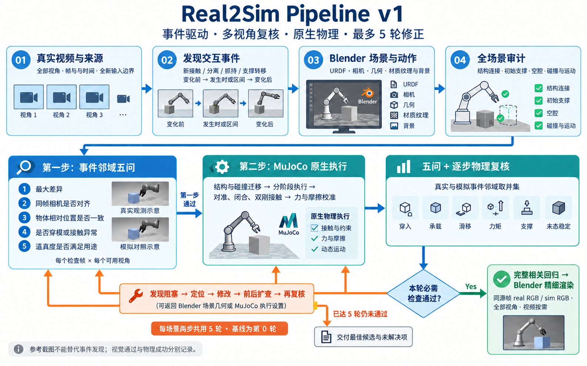

# Real2Sim Skills

当前工作版本：**v3（Robot / Human 双输入与动作重定向版）**。已有历史标签保持不动，不重写同名旧标签。

[Real2Sim Prompt v3](skills/real2sim-prompt/SKILL.md) 包含两步：

1. 真实输入首帧 → 按可用相机、深度或 Pi3 估计初始化核心物体与目标机器人 → 全部真实视角的投影/灰模/五问检查。支持单视角与多视角，不虚构缺失视角。
2. 真实事件发现 → 按 robot/human 分支恢复或重定向动作 → 关键帧五问与按需邻域回归 → MuJoCo 接触执行与独立验收 → 回传 Blender 三方对照。

v1 增强：材质、纹理、灯光与主要背景补全；MuJoCo 原生轨迹回传 Blender 精细渲染；多视角联合拟合与留出帧检查；有假设、检查实际生效参数的接触校准。保留逐事件五问、异常前后检查和用户接受后的停止条件。

本次整合强化**事件驱动关键帧**：先从真实视频发现关系变化，再选事件前、发生时与事件后的证据。参考截图不能替代事件覆盖；真实与模拟事件独立记录，五问与逐步物理判定共同复核，异常向前后扩查。

修正持续累计，不设次数上限（`max_iterations=null`）；本轮必需检查通过或用户明确接受当前范围后停止。首帧接受不代表动作或物理成功。背景选择显著核心物体，每个构建完整实体结构，不以点云后处理薄面替代。

[首帧初始化](skills/real2sim-prompt/references/geometry-initialization.md) · [动作与物理衔接](skills/real2sim-prompt/references/motion-execution.md)

[整体流程与经验](docs/pipeline-v1.md) · [关键帧、邻域五问与物理判据](skills/real2sim-prompt/references/events-and-review.md)

历史 v1 示意（当前阶段划分以上文和 skill 为准）：

## 使用

将 `skills/real2sim-prompt` 文件夹放入 Codex 的个人 skills 目录 `~/.codex/skills/`，使用 `$real2sim-prompt` 调用。保留完整文件夹，入口会按需引用 `references/` 中的说明。

[Real2Sim Prompt.md](Real2Sim%20Prompt.md) 是便于直接阅读的入口副本。主要维护文件位于 `skills/real2sim-prompt/`。

## 范围

本仓库发布操作流程与参考说明，不包含场景数据、模型权重、Blender/MuJoCo 场景资产或通用转换程序。文档内的本地案例路径仅说明经验来源，不代表这些案例已经打包。任务成功、几何验收和视觉对齐分别记录。

## 两步共用能力

- 第一步：Pi3 联合相机/点云/置信度 → GPT + SAM 共享实例 → 完整核心物体 mesh 与 URDF/XML 机器人 → 多视角投影迭代与首帧接受记录。
- 第二步：真实事件与运动恢复 → 事件邻域五问 → MuJoCo 分段接触执行 → 完整物理回归 → 原生状态回传 Blender。
- 抓取依次检查对准/角度、闭合量、双侧接触/滑移，再校准抓持力与摩擦。
- 原生机器人、物体和物料统一绑定，重开 Blender 工程检查变换；按需输出同源 Real / Blender / MuJoCo 三方关键帧。
- 修正不设次数上限；复用未失效缓存，仅渲染本轮所需关键帧或视频。具体停止条件以 skill 为准。

发布流程版本不代表所有案例已经通过视觉五问；任务成功、几何/数值稳定和视觉对齐分别报告。检查脚本只验证记录覆盖与证据关联，不代替实际看图。

## v3 双输入分支

- **Robot real data**：同硬件优先复用实测关节、末端与开合；缺少状态时由视觉与对应关节链拟合。更换硬件时显式执行 robot-to-robot 重定向。
- **Human real data**：第一步配置目标机器人与静态初态；第二步第 3 环节将手/指尖与物体相对动作重定向为目标机器人的 TCP、方向、开合及关节参考，第 4 环节复核，再执行物理验证。
- 第二步统一为八环节：接收场景、发现事件、恢复/重定向运动、五问复核、物理装配、分阶段执行、完整回归、回传与外观优化/三方输出。
- 记录源动作与机器人适配的区别、各臂角色、坐标/尺度、时间缩放及生成续接段。单臂操作不能宣称双臂协作通过；无真实对应的续接帧单列。

[双输入与重定向规范](skills/real2sim-prompt/references/input-and-retargeting.md) · [八环节说明](skills/real2sim-prompt/references/motion-execution.md)

v3 发布的是流程支持，不代表全部机器人、人手任务或高保真重建已通过实测。两类输入共用独立的视觉、物理与时间验收。
